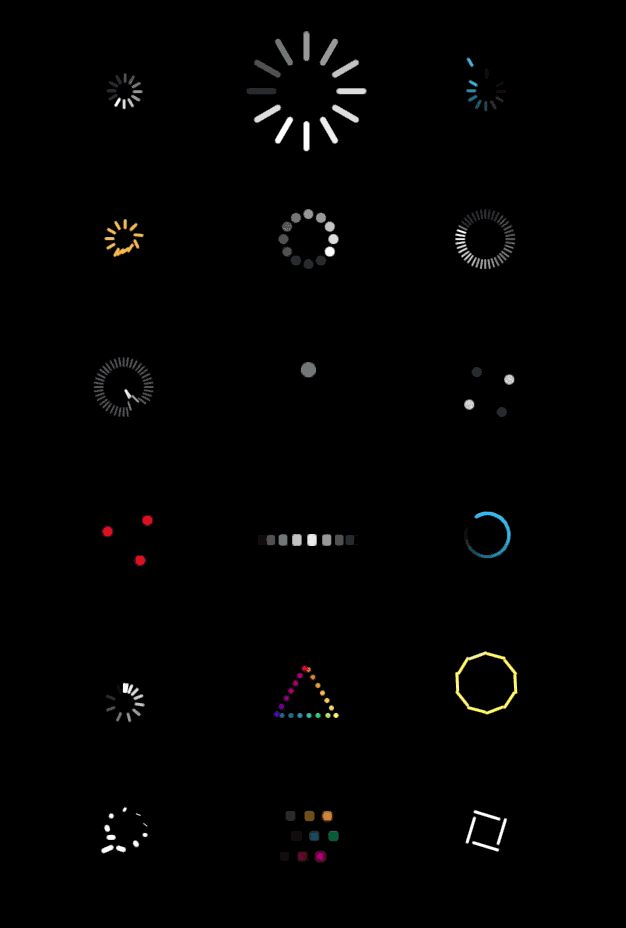

# Activity Indicator Framer Module

This module generates looped array animation such as an an iOS activity indicator. Animation is controlled by adding animation states which are triggered in sequence. If the radial option is true, objects are arranged in a radial array, like a spinner. If set to false, the objects will animate to their positions and properties. 

The animations will start pre-looped by default, as if it had already played a cycle. This is useful so the animation is consistently animated in a loop from the time it appears.



# Installation
- Create a new Framer project
- Copy the `activityIndicator.coffee` file (located in activityIndicator.framer/modules) to the `modules` folder in your project

# Usage
Include the script using the following code ('Spinner' can be any text you want)
```coffeescript
Spinner = require "activityIndicator.coffee"
```

Initiate using the following code ('Spinner' being the instance name used in the include aboce) to create a new activity indicator with default settings:
```coffeescript
mySpinner = new Spinner
```

# Options
General global options applied to the spinner. If ommitted, the defaults are used as listed below. (Note: Standard layer properties can be applied as normal, such as x, y, z, scale, rotation, opacity etc.)

Using anything other than `'ease-in'`, `'ease-out'` and `'ease-in-out'` for `curve` will mess up the timing (sometimes with interesting quirks) as the next animation in the sequence is triggered on animation end, but the overall timing of the sequence and the pre-looped properties are calculated from the `time` setting of the objects.

```coffeescript
mySpinner = new Spinner
    radial:true #true / false - if its a radial array. If false, need x and y positions on states
    count:12 #amount of objects
    cycles:1 #amount of animation cycles
    direction:1 #1 forwards, -1 backwards. The direction of the sequence triggering for radial arrays
    startLooped:true #whther the animations start pre-looped
    width:3 #width of the objects
    height:10 #height of the objects
    radius:8 #radius of the radial array (only applies if radial is true)
    originX:0.5 #originX of the objects
    originY:0 #originY of the objects
    perspective:100 #perspective for the objects if z is used
    backgroundColour: 'white' #background color of the objects
    curve: 'ease-out' #curve for the objects animations
    borderRadius:1.5 #border radius dynamically set to half the width
    paused:false #whether the spinner starts paused
```

# Animation
- Animation states are added as objects with properties. These can be any name you wish but must be unique.
- Positions are relative to the spinner instance created.
- Time can be set to zero which you can use as a way of setting object properties.
- If you specify a time for the first state, it is tweened from the last state (unless time is 0)
- If setting a rotation property on an animation state, you need to set a rotation property for all other animation states.

```coffeescript
mySpinner = new Spinner
    myState1:
        time:0.5 #time of this tween
        opacity:1 #opacity
        width: 3 #width
        height: 10 #height
        radius: 8 #radius if in radial mode
        angle: 0 #the angle offset of this object
        originX:0.5 #originX of this object
        originY:0 #originY of this object
        x:0 #position x
        y:0 #position y
        z:0 #position z (parent perspective defaults as 100 unless set)
        scale:1 #scale
        backgroundColour: 'white' #background color of this object
        curve: 'ease-out' #curve for this tween
        borderRadius:1.5 #border radius for this object (defaults to half the width)
    state2:
        time:0
        opacity:0
    anotherState:
        time:0.5
        opacity:1
````

# Example
The example below was used to create the screengrab above:
```coffeescript
background = new BackgroundLayer
		backgroundColor: "#000"

Spinner = require 'activityIdicator'

defaultSpinner = new Spinner
	
bigSpinner = new Spinner
	height:30
	width:6
	radius:30
	
blueSpinner = new Spinner
	count:12
	state1:
		backgroundColor:'#00BFFF'
		radius:10
		time:0
		opacity:0
	state2:
		backgroundColor:'#00BFFF'
		radius:30
		time:0.2
		opacity:1
		curve:'ease-out'
	state2a:
		backgroundColor:'#00BFFF'
		radius:30
		time:0.5
		opacity:1
	state3:
		backgroundColor:'#00BFFF'
		radius:10
		time:0.2
		opacity:1
		curve:'ease-in'
	state4:
		backgroundColor:'#00BFFF'
		radius:10
		opacity:0
		time:8
	
orangeSpinner = new Spinner
	state1:
		backgroundColor:'#FFBF11'
		radius:10
		time:0
	state2:
		backgroundColor:'#FFBF11'
		radius:10
		angle:100
		time:0.3
	state3:
		backgroundColor:'#FFBF11'
		radius:10
		angle:0
		time:0.5
	state4:
		backgroundColor:'#FFBF11'
		radius:10
		angle:0
		time:0.5

dotsSpinner = new Spinner
	radius:20
	length:10
	width:10
	time:0.5
	cycles:2

progressSpinner = new Spinner
	startLooped:false
	count:40
	radius:20
	length:5
	width:2
	time:4
	
barsInToMiddleSpinner = new Spinner
	count:40
	radius:20
	length:5
	width:2
	time:2
	state1:
		opacity:0.3
		radius:20
		time:0
	state2:
		opacity:1
		radius:0
		time:0.4
	state3:
		opacity:0.3
		radius:20
		time:0.6
	state4:
		opacity:0.3
		radius:20
		time:7
	
singleDotSpinner = new Spinner
	length:10
	width:10
	radius:20
	cycles:2
	fromNothing:
		opacity:0
		time:0
	bigBlob:
		opacity:1
		time:0.2
		scale:2
		radius:0
	toNothing:
		opacity:0
		time:0.2
		scale:1
	gap:
		opacity:0
		time:2
	
fourDotsRotatingSpinner = new Spinner
	radial:false
	width:10
	height:10
	count:4
	state1:
		x:-20
		y:-20
		curve:'ease-in-out'
		opacity:0
	state2:
		x:20
		y:-20
		curve:'ease-in-out'
	state3:
		x:20
		y:20
		curve:'ease-in-out'
		opacity:0
	state4:
		x:-20
		y:20
		curve:'ease-in-out'

redDotTriangleRotatingSpinner = new Spinner
	radial:false
	width:10
	height:10
	count:3
	state1:
		x:-20
		y:-20
		curve:'ease-in-out'
		backgroundColor:'red'
	state2:
		x:20
		y:-20
		curve:'ease-in-out'
		backgroundColor:'red'
	state3:
		x:20
		y:20
		curve:'ease-in-out'
		backgroundColor:'red'
	state4:
		x:-20
		y:20
		curve:'ease-in-out'
		backgroundColor:'red'

horizontalBarJogWheel = new Spinner
	radial:false
	count:10
	height:10
	width:8
	borderRadius:2
	originY:0.5
	state1:
		x:-50
		time:0
		opacity:0
		curve:'ease-out'
	state2:
		x:0
		time:1.5
		opacity:1
		curve:'ease-in'
		scale:1.2
	state3:
		x:50
		opacity:0
		time:1.5
		

blueSwirlSpinner = new Spinner
	height:3
	width:5
	radius:20
	count:120
	direction:-1
	backgroundColor:'#00BFFF'
	state1:
		opacity:1
		time:0
	state2:
		opacity:0
		time:0.4

barsRoundSpinSpinner = new Spinner
	radial:false
	curve:'ease-in'
	originY:2
	state1:
		x:0
		rotation:0
		time:0
	state2:
		x:0
		rotation:360
		time:2
		opacity:0
		
		
rainbowTriangle = new Spinner
	radial:false
	curve:'linear'
	count:20
	height:5
	width:5
	state1:
		x:0
		y:-20
		backgroundColor:'red'
	state3:
		x:30
		y:30
		backgroundColor:'yellow'
	state4:
		x:-30
		y:30
		backgroundColor:'blue'
		
barsFlatToSpinner = new Spinner
	height:20
	count:10
	state1:
		radius:10
		time:0
		angle:0
		backgroundColor:'red'
	state2:
		radius:30
		time:0.1
		angle:105
		backgroundColor:'yellow'
		curve:'spring(203, 10, 17)'
	state3:
		radius:10
		time:0.3
		backgroundColor:'red'
	state4:
		radius:10
		time:1
		backgroundColor:'yellow'

rotatingBarsSpinner = new Spinner
	height:10
	width:5
	count:10
	radius:20
	curve:'linear'
	state1:
		angle:0
		height:14
		time:0
	state2:
		angle:360
		height:0
		time:1
	state3:
		angle:180
		time:1

rainbowDotRows = new Spinner
	radial:false
	count:10
	height:10
	width:10
	radius:20
	borderRadius:3
	curve:'linear'
	state1:
		x:30
		y:-20
		time:0
		backgroundColor:'red'
		curve:'ease-out'
	state2:
		x:-30
		y:-20
		time:1
		backgroundColor:'yellow'
		opacity:0
	state3:
		x:30
		y:0
		time:0
		backgroundColor:'green'
		curve:'ease-out'
	state4:
		x:-30
		y:0
		time:1
		backgroundColor:'blue'
		opacity:0
	state5:
		x:30
		y:20
		time:0
		backgroundColor:'red'
		curve:'ease-out'
	state6:
		x:-30
		y:20
		backgroundColor:'purple'
		opacity:0

t = 1
rotatingSquareSpinner = new Spinner
	radial:false
	height:28
	count:4
	curve:'ease-in-out'
	state1:
		x:-20
		y:-20
		rotation:-90
		time:t
	state2:
		x:20
		y:-20
		rotation:0
		time:t
	state3:
		x:20
		y:20
		rotation:90
		time:t
	state4:
		x:-20
		y:20
		rotation:180
		time:t
	state5:
		x:-20
		y:20
		rotation:-180
		time:0


# arrange in a grid
rowHeight = Framer.Device.screen.height/6.3
columnWidth = Framer.Device.screen.width/3.5
offsetX = Framer.Device.screen.width/5
offsetY = Framer.Device.screen.height/10
rows = 6
columns = 3
r=0
i=0
for child in Framer.CurrentContext.layers
	if child.parent is null
		if child.constructor.name is "BackgroundLayer"
			continue
		col = i % columns
		child.x = col*columnWidth + offsetX
		child.y = rowHeight*r + offsetY
		if col is columns-1
			r++
		i++

```


